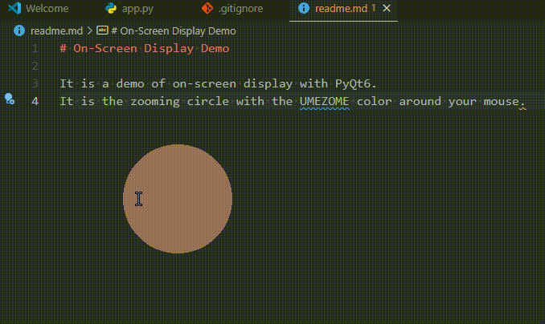

# On-Screen Display Demo

It is a demo of on-screen display with `PyQt6`.
It is the zooming circle with the UMEZOME(#E9A368) color around your mouse.

It has been compiled into the [app.exe](./dist/app.exe) by the `pyinstaller` in the Win11 OS.

